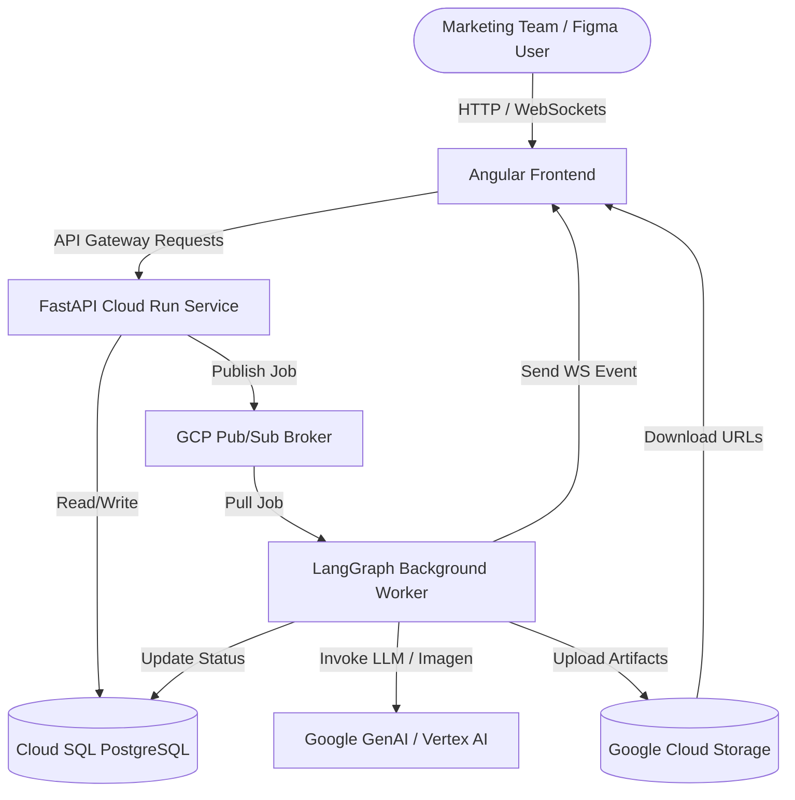
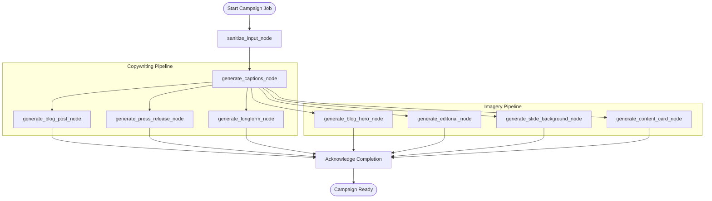

# Marketing Gen-AI: Enterprise Campaign Generator

An enterprise-grade Generative AI marketing platform that automates campaign creation by synthesizing multi-format visual assets, copy, and document presentation decks tailored to brand guidelines, subsectors, and buyer personas.

---

## 🎥 Video Demonstration

*Click the image above to view the complete walk-through of the Marketing Gen-AI platform.*

---

## 🚀 Application Functionality

The Marketing Gen-AI application guides marketing teams through a structured campaign creation wizard, generating all required copywriting copy and visual assets in under a minute:

1. **Targeting Matrix:** Select a subsector (e.g., Trucking & Local, Enterprise Logistics), audience persona (e.g., Fleet Safety Manager), and buyer journey stage (e.g., Awareness, Decision).
2. **Asset Association:** Match campaign topics with specific physical inventory tags (e.g., `#dashcam`, `#semi-truck`) uploaded to the company's shared **Asset Library**.
3. **Brand Governance Enforcement:** Dynamically overlay organization logos, apply brand-specific colors, filter out blacklist words, and enforce typography.
4. **Interactive Editing:** Regenerate individual images or copy texts on the fly using natural language refinement prompts.

---

## 🏗️ System Architecture

The application uses an event-driven microservices architecture built on Google Cloud Platform:

### Google Cloud Platform (GCP) Components

- **Cloud Run:** Hosts the containerized FastAPI server (`api-service`) and the background processor (`ai-worker`) inside a serverless environment.
- **Cloud Pub/Sub:** Acts as the asynchronous message broker. It handles job queuing between FastAPI and the LangGraph worker to prevent HTTP timeout bottlenecks.
- **Google Cloud Storage (GCS):** Serves as the binary and text repository, storing raw assets, generated copy, and compiled DOCX/PPTX files.
- **Cloud SQL (PostgreSQL):** Tracks active campaigns, logs workflow status, stores brand guidelines, and manages the shared Asset Library.

---

## 🧠 Generative AI & LLM Tools

The orchestration engine leverages Google's state-of-the-art GenAI models:

- **Gemini 3.5 Flash:** Evaluates input prompts against brand constraints, identifies PII leaks, generates structured copy (Blog, Press Release, Long-form), and creates relevant short captions.
- **Vertex AI Imagen 4.0 (`imagen-4.0-generate-001`):** Synthesizes premium, high-fidelity marketing graphics corresponding to the aspect ratios required for various target media channels.

---

## ⚡ LangGraph Orchestration & Node Flow

The generation pipeline is modeled as a state-based workflow using **LangGraph**, providing a predictable path from raw prompt inputs to compiled outputs:

### Node Workflow Breakdown

1. **`sanitize_input_node`:** Redacts PII (emails, SSNs, phone numbers) and cross-references user prompt words against the organization's database-governed forbidden words blacklist.
2. **`generate_captions_node`:** Prompts Gemini to create a JSON array of exactly 8 to 10 short, professional marketing slogans matching the campaign parameters.
3. **Copy Nodes:** Generate clean markdown copy files for the Blog Post, Press Release, and Long-form Document.
4. **Visual Nodes:** Build independent prompts using target design presets and query Imagen to output:
   - **Blog Hero (16:9):** Wide banner featuring commercial environments.
   - **Editorial (4:3):** Inline graphic depicting fleet operations.
   - **Slide Background (16:9):** A text-free, abstract gradient layout.
   - **Content Card (1:1):** Social media graphic featuring a card layout and a typography overlay.

---

## 📥 Generated Artifacts

Once the LangGraph pipeline completes, the FastAPI gateway compiles the campaign components into standard business files:

| Artifact Type | File Format | Layout Style | Delivery Channel |
| :--- | :--- | :--- | :--- |
| **Blog Hero** | PNG (`image/png`) | 16:9 Landscape | Blog / Website Header |
| **Inline Editorial** | PNG (`image/png`) | 4:3 Layout | Print / Press Article |
| **Slide Background** | PNG (`image/png`) | 16:9 Widescreen (Text-Free) | Presentation Backdrop |
| **Social Content Card** | PNG (`image/png`) | 1:1 Square | LinkedIn / X / Social Posts |
| **Blog Post** | Text (`text/markdown`) | Engagement Copy | Web Publishing |
| **Press Release** | Text (`text/markdown`) | Corporate Copy | Media Outlets |
| **Long-form Document** | Text (`text/markdown`) | Detailed Report | Sales Collateral |
| **Campaign Blueprint** | Word (`.docx`) | Formatted Docx | Downloadable Document |
| **Presentation Slide Deck** | PowerPoint (`.pptx`) | 10 Widescreen Slides | Sales / Pitch Presentation |